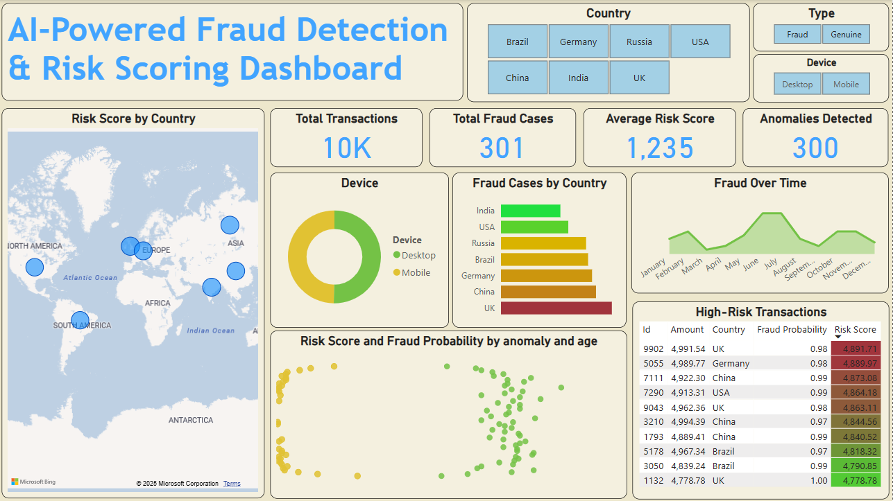

# 🛡️ AI-Powered Fraud Detection & Risk Scoring System

## 🚀 Project Overview

This project is a comprehensive **AI-based Fraud Detection & Risk Scoring System**, designed to identify fraudulent financial transactions and assess risk using advanced machine learning models. It includes anomaly detection using **Isolation Forest**, fraud probability scoring using **Logistic Regression**, and a visual risk dashboard built in **Power BI**.


## 📊 Dashboard Highlights




This interactive dashboard shows fraud trends, device/country breakdowns, fraud probability vs risk score, anomaly detection, and more. It helps financial institutions and analysts quickly identify and mitigate high-risk transactions.


## 📁 Files Included

- `notebook.ipynb` - Complete Python code for data generation, modeling, and export
- `Dashboard.pbix` - Power BI dashboard file
- `DashBoard.png` - Final dashboard screenshot
- `Daily Average Transaction Amount.png` - Line chart
- `Distribution of Transaction Amounts.png` - Histogram chart


## 🛠️ Technologies Used

- Python (Pandas, NumPy, Seaborn, Scikit-learn, Matplotlib)
- Machine Learning (Isolation Forest, Logistic Regression)
- Power BI for dashboarding
- Jupyter Notebook


## 🧠 Key Features & Models

### 🔹 Data Generation
Synthetic transaction data was generated with:
- 10,000 records
- Attributes: `user_id`, `age`, `transaction_time`, `amount`, `payment_method`, `device`, `country`, `is_fraud`.

### 🔹 Anomaly Detection - Isolation Forest
Unsupervised learning to detect unusual transaction patterns.

### 🔹 Fraud Probability Prediction - Logistic Regression
A classifier was trained to predict the likelihood of fraud (`fraud_probability`) using transaction features.

### 🔹 Risk Score Calculation
Risk score = `fraud_probability * amount`, scaled for visualization.


## 📉 Visual Insights

### 🔸 Daily Average Transaction Amount


This shows average spending patterns over time, useful to track fraud spikes.

### 🔸 Distribution of Transaction Amounts


This histogram shows how most transactions are small, with a few high-value ones—common in fraud detection datasets.


## 🧾 Final Insights

- **Most fraud cases** originated from countries like the UK and China.
- **Mobile devices** had a slightly higher fraud probability than desktops.
- **High-risk users** had both high fraud probability and large transaction amounts.
- **Isolation Forest** effectively flagged outliers.
- **Power BI dashboard** enables interactive filtering for deep exploration.


## 📦 How to Use

1. Clone this repository:
   ```bash
   git clone https://github.com/yourusername/fraud-detection-dashboard.git
2. Open the notebook and run all cells to generate & process data.

3. Open the Power BI dashboard file (Dashboard.pbix) to explore and customize the visuals.

🙌 Author
Made by [sai teja yaruva]

Feel free to connect and collaborate on similar data projects!
